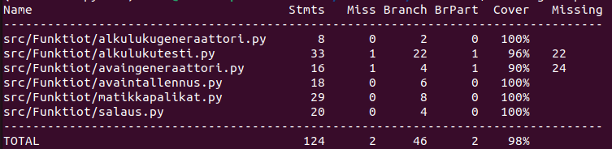

# Testaamisesta

Testit voi ajaa komennolla "coverage run --branch -m pytest src" ja komennolla "coverage report -m" saa kattavuusraportin tulostettua terminaaliin.

Sovelluslogiikkaa on testattu yksikkötesteillä. Käyttöliittymiä manuaalisesti.

Testailin pythonin unittestillä ehkä osittain turhiakin asioita. Testasin mm.
 - onko tuottamani pienten alkulukujen listan sisältö on oikein.
 - factor_out funktiota testasin kahdella luvulla, parillisella ja parittomalla
 - koitin alkulukutestiä parittomalla komposiitilla
 - luon 40 kpl potentiaalisia alkulukuja ja tarkastan ne sympyn isPrime()-funktiolla. Hyväksyn yhden hudin, koska kyse on epädeterministestä funktiosta kuitenkin.
 - testaan matikkapalikat.py:n apufunktiot yksittäisillä syötteillä. Tämä tuntuu nimelliseltä testikattavuuden kasvattamiselta, mutta jos jokin isompi ei toimi ja joku näistä testeistä epäonnistuu, on kait helppo lähteä liikkeelle täältä.
 - avaimia testaan lähtökohtaisesti vain, onko tulosteen tyyppi oikein. Avaimen luomiseen liittyy satunnaisuutta, enkä keksinyt kuinka luoda kattavaa ja determinististä testiä, joka antaisi parempaakaan dataa ulos.
 - Salausta testaan purkamalla. Purku ei toimi, jos salaus ei toimi. Purun osalta testaan oikeaa avainta, väärää avainta ja huonoa tiedostonimeä.
