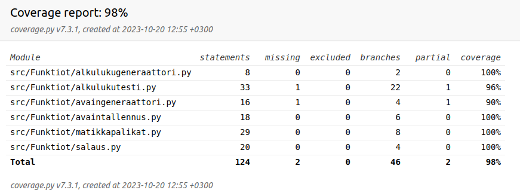

# Testaamisesta

Testit voi ajaa komennolla "coverage run --branch -m pytest src" ja komennolla "coverage report -m" saa kattavuusraportin luotua
 Sovelluslogiikkaa on testattu yksikkötesteillä. Käyttöliittymiä manuaalisesti.

Testikattavuuden ulkopuolella itse avaimen luonti. En ole ihan varma kuinka testaisin sitä, kun on sattumaa mukana. Sen palaset toimivat kuitenkin. Alkulukutestiä itsessään testaan luomalla 40 potentiaalista alkulukua ja sallin yhden epäonnistuneen. Varmistan alkuluvut pythonen sympy-kirjaston isprime()-funktiolla.
