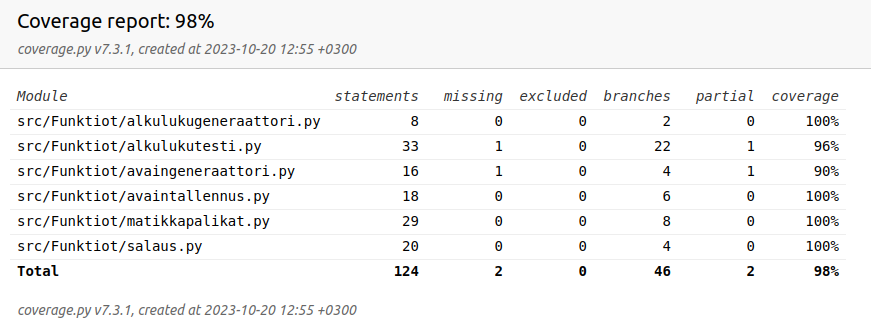

# Testaamisesta

Testit voi ajaa komennolla "coverage run --branch -m pytest src" ja komennolla "coverage report -m" saa kattavuusraportin tulostettua terminaaliin.

Sovelluslogiikkaa on testattu yksikkötesteillä. Käyttöliittymiä manuaalisesti.

